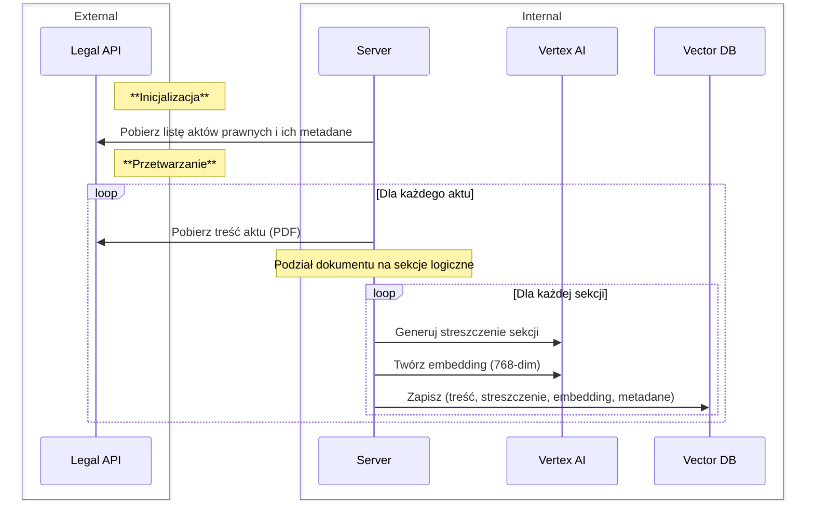
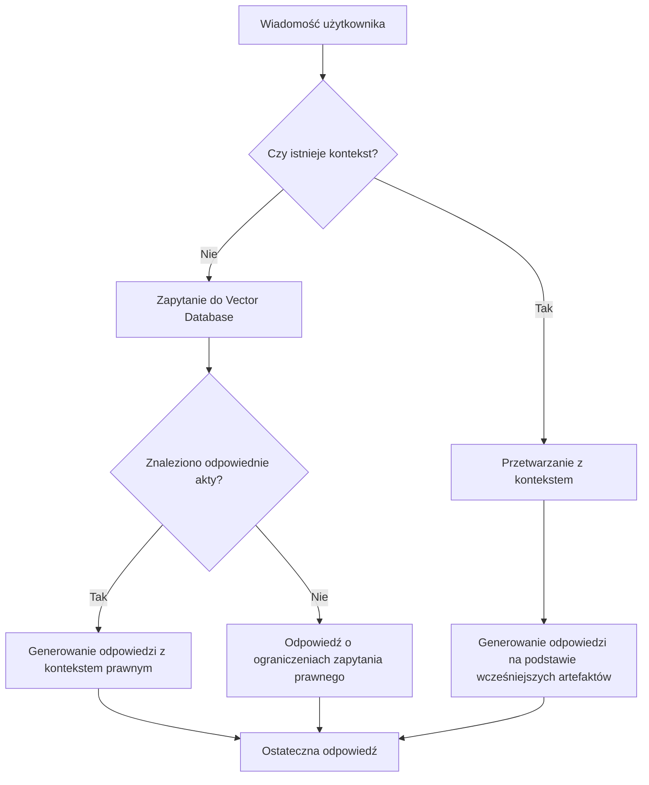

# Architektura Projektu

## Architektura Backend

Tech stack:
- Python
- Django
- Postgres + pgvector
- Vertex AI
- Docker Compose
- Początkowo LangChain (obecnie nieużywany)

### Diagram Sekwencji

### Kluczowe Informacje

1. **Testowanie Embeddings**: Testy pokazują, że używanie tylko streszczeń zamiast pełnej treści obniża trafność o około **20%**. Dlatego streszczenia stosowane są wyłącznie na poziomie frontendu.
2. **Metadane Rozdziałów**:
   - **Start/End**: Numery stron, na których rozpoczyna i kończy się rozdział
   - **Nazwy Rozdziałów**: Tytuły lub podtytuły ułatwiające odwołania

Przykładowe zapytanie [GET /q=apteki i szpitale](https://sejm-stats.pl/apiInt/vector-search/?q=%22apteki%20i%20szpitale%22)

[Kod z fazy research](https://github.com/miskibin/sejm-stats/blob/main/research/embedings.ipynb) (na samym końcu znajdują się testy semantyczne)

## **Asystent RP**

### Tech stack
- TypeScript
- Next.js, React, Tailwind, shadcn
- Supabase
- Together AI, OpenAI
- Vercel

### Schemat Blokowy

### Kluczowe Szczegóły Procesu

1. **uwaga do kroku: `Znaleziono odpowiednie akty?`**:
   - Model przetwarza **streszczenia** sekcji z `n` najistotniejszych aktów prawnych zwróconych przez bazę danych. Ponieważ streszczenia są około **10 razy krótsze** niż oryginalne sekcje, jest to efektywna metoda wyboru odpowiedniej treści prawnej
   - Z tych streszczeń wybierane są **od 0 do 3** najbardziej adekwatne sekcje, aby odpowiedzieć na zapytanie użytkownika

2. **Używanie Poprzednich Artefaktów**:
   - **Poprzednie Artefakty** to poprostu sekcje aktów prawnych wykorzystane we wcześniejszych odpowiedziach
   - Dzięki temu asystent może zapewnić ciągłość odpowiedzi, odnosząc się do wcześniejszych treści prawnych, co wzbogaca odpowiedź i utrzymuje kontekst

3. **Rezygnacja z LangChain**:
   - LangChain.js jest znacznie mniej rozwinięty niż pakiet Pythonowy. Biblioteka nie wspiera `ollama` ani `Together AI`
   - Cele dydaktyczne. (Chciałem lepiej zrozumieć proces działania RAG).

Nie wykluczam jednak powrotu do LangChain w przyszłości, jeśli będzie on bardziej rozwinięty i dostosowany do moich potrzeb.

4. **Rozszerzalność**
    
    Asystent jest zaimplementowany tak aby: 
    - Wspierać wiele różnych narzędzi bez potrzeby zmian w kodzie
    - Umożliwiać dodawanie nowych `providers` modeli  NLP (np `ollama`) bez konieczności zmian w kodzie

5. Obecnie koszt jednego zapytania do agenta wynosi około 1 grosz dla modelu `gpt-4o-mini`. Około 80% błędnych odpowiedzi zgłaszanych przez użytkowników nie pojawiłoby się, gdyby model otrzymywał dwa razy więcej danych wejściowych na wejściu.

### Źródła
- [Asystent RP](https://chat.sejm-stats.pl/)   
    -  [repozytorium](https://github.com/miskibin/asystent-rp)

- [sejm stats](https://sejm-stats.pl/)  
    -  [repozytorium](https://github.com/miskibin/sejm-stats)

- [Kanał yt](https://www.youtube.com/@sejm-stats)