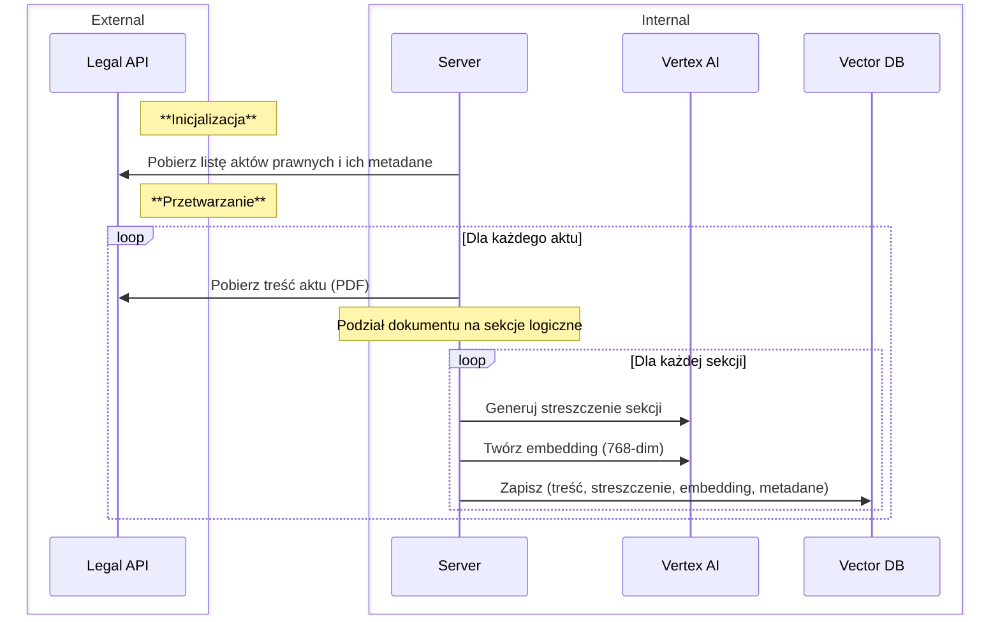
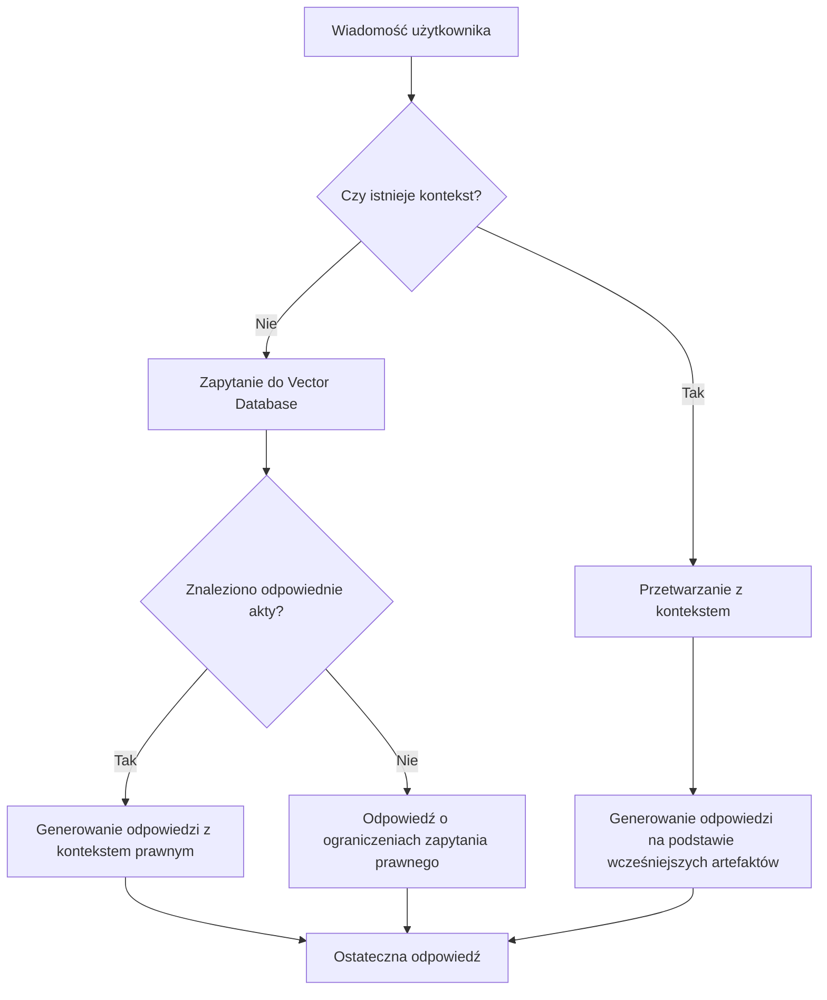

## **Architektura Projektu**

### Architektura Backend

**Tech Stack Backend**: 
- Python
- Django
- PostgreSQL + pgvector
- Vertex AI
- Docker Compose

#### Diagram Sekwencji Przetwarzania

#### Kluczowe Informacje Backend

1. **Testowanie Embeddings**: 
   - Przeprowadzono testy różnych konfiguracji danych wejściowych do modelu wektoryzującego. Użycie jedynie streszczeń zamiast pełnej treści obniża trafność o około **20%**. Dlatego streszczenia stosowane są wyłącznie na poziomie frontendu.

2. **Metadane Rozdziałów**:
   - **Start/End**: Numery stron, na których rozpoczyna i kończy się rozdział
   - **Nazwy Rozdziałów**: Tytuły lub podtytuły dla łatwiejszego odwołania się do konkretnych części aktu

**Przykładowe zapytanie:**  
[GET /q=apteki i szpitale](https://sejm-stats.pl/apiInt/vector-search/?q=%22apteki%20i%20szpitale%22)

**Kod z fazy research:**  
[embedings.ipynb](https://github.com/miskibin/sejm-stats/blob/main/research/embedings.ipynb)  
(Końcowe sekcje notebooka zawierają testy semantyczne)

---

### **Asystent RP** – Architektura Frontend

**Tech Stack Frontend**:
- TypeScript
- Next.js, React, Tailwind, shadcn
- Supabase
- Together AI, OpenAI
- Vercel
- (Początkowo) LangChain (teraz wykorzystywany tylko jako referencja)

#### Schemat Blokowy Procesu

#### Kluczowe Szczegóły Procesu Frontend

Przy wyszukiwaniu wykorzystywana jest miara `cosine simmilarity`. 

1. **Krok: Znaleziono odpowiednie akty?**
   - Model przetwarza streszczenia sekcji z **n** najistotniejszych aktów prawnych zwróconych przez bazę danych.
   - Streszczenia są o **90% krótsze** niż oryginalne sekcje, co pozwala efektywnie wybrać odpowiednie treści prawne.
   - Spośród streszczeń wybierane są **0 do 3** najbardziej adekwatne sekcje do odpowiedzi na zapytanie użytkownika.
   - Pełni funkcję rerankingu wyników z bazy danych. 

2. **Używanie Poprzednich Artefaktów**
   - Poprzednie Artefakty to sekcje aktów prawnych użyte we wcześniejszych odpowiedziach.
   - Pozwala to na zachowanie ciągłości odpowiedzi i utrzymanie spójnego kontekstu.

3. **Rezygnacja z LangChain**
   - LangChain.js jest znacznie mniej rozwinięty niż jego wersja Pythonowa; nie obsługuje `ollama` ani `Together AI`.
   - Dydaktyczne podejście – lepsze zrozumienie procesu działania RAG.
   - Powrót do LangChain rozważany, jeśli jego możliwości rozwiną się w przyszłości.

4. **Rozszerzalność**
   - Asystent wspiera wiele różnych narzędzi bez potrzeby modyfikacji kodu.
   - Dodanie nowych `providers` NLP, takich jak `ollama`, jest możliwe bez istotnych zmian w kodzie.

5. **Koszt i Efektywność Modelu**
   - Koszt jednego zapytania do agenta wynosi około **1 grosz** dla modelu `gpt-4o-mini`.
   - 80% zgłaszanych błędów w odpowiedziach wynika z niedostatecznej ilości danych na wejściu – zwiększenie ilości danych dwukrotnie zmniejszyłoby liczbę błędnych odpowiedzi.

### Źródła Projektu

- [Asystent RP](https://chat.sejm-stats.pl/)   
    -  [Repozytorium](https://github.com/miskibin/asystent-rp)

- [Sejm Stats](https://sejm-stats.pl/)  
    -  [Repozytorium](https://github.com/miskibin/sejm-stats)

- [Kanał YouTube](https://www.youtube.com/@sejm-stats)