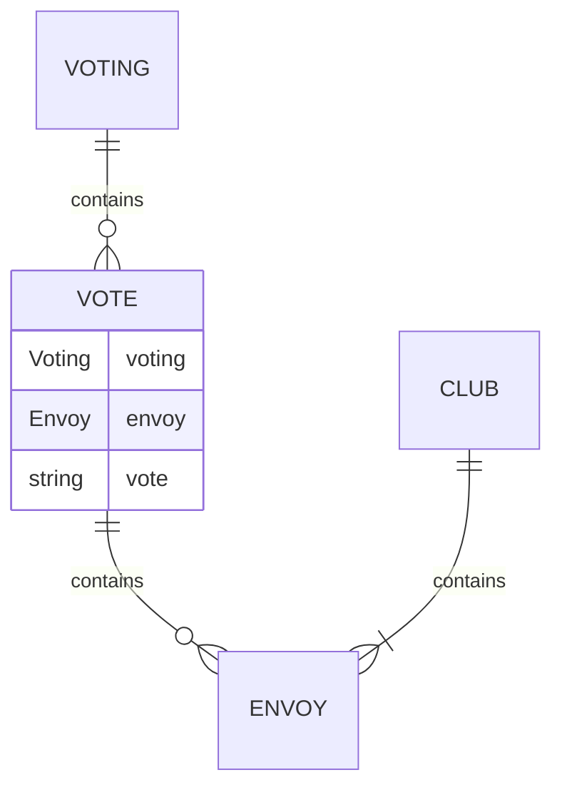
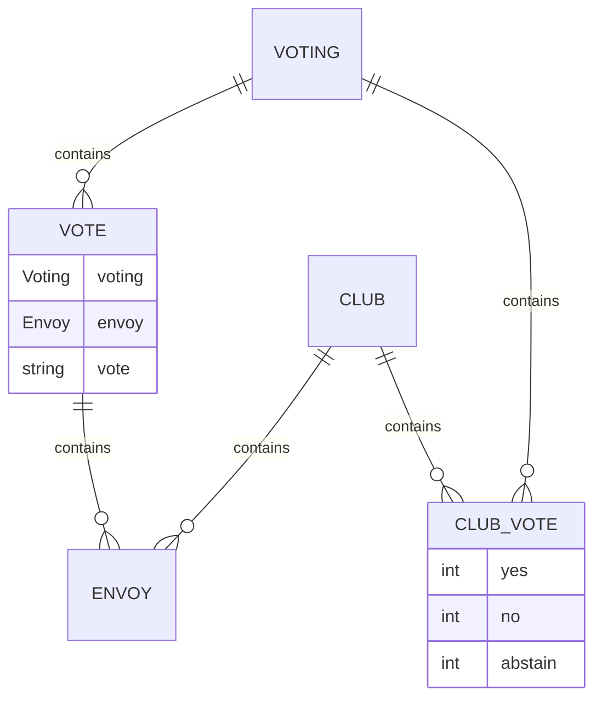

# Devlog 1

Cześć chciałbym ci opowiedzieć o projekcie, który tworzę przez ostatnie pół roku 
i wierzę, że może on uczynić polskę lepszym miejscem. 

Mówię o stronce, która pozwoli ci zweryfikować czy a raczej jak bardzo rządzący cię oszukują.

Zacznijmy od początku:

### Motywacja

Po ostatnich wyborach postanowiłem sprawdzić, jacy posłowie weszli do parlamentu. 
Wszedłem na oficjalną stronę sejmu i zdałem sobie sprawę, że świat idzie do przodu
a strona sejmowa stoi w miejscu. Niewyraźne zdjęcia, brak możliwości filtrowania, źle rozplanowany interfejs i tak dalej. Domyśliłem się, że musi istnieć api z dostępem do tych danych i stwierdziłem że sam dla siebie napiszę podstronę sejmu z listą posłów. Po napisaniu stwierdziłem, że wyszło fajnie i nawet wkręciłem się w temat. 
Powiedziałem dziewczynie, że mam dużo nauki, na studiach, że jestem chory i wziąłem się do pracy.
Oczywiście poprostu kopiowanie strony sejmu nie ma sensu, tak więc najpierw zastanowiłem się co chciałbym wiedzieć jako obywatel

Po pierwsze chciałbym wiedzieć jak faktycznie zmienia się prawo. Na przykład, gdybym był kierowcą ciężarówek i usłyszałem jakieś plotki o tym, że od teraz mogę jeździć tylko 6h dziennie, to chciałbym wiedzieć czy to prawda.
Stworzyłem więc wyszukiwarkę wszystkich informacji sejmowych, sprawdźmy jak to działa. 
To co widzisz to inteligentna wyszukiwarka wszystkkich ustaw interpelacji i uchwał sejmowych.
Na razie jest w fazie rozwoju, daj znać co można by tu dodać.

Kojarzysz jak niektórzy posłowie twierdzą, że robią co się da w sprawie protestu rolników? Tutaj można to łatwo zweryfikować. Wpisujemy frazę i wychodzi szydło z worka.
A teraz troche z innej beczki. 
Ile razy na wyborach nie byliście pewni kogo wybrać? Może mieliście wybraną partię ale nie byliście pewni komu z listy ufacie najbardziej ? Załóżmy, że chcesz głosować na PSL i głosujesz w okręgu rzeszowskim.
Wyszukujesz, czytasz biografię, patrzysz jakie interpelacje dany poseł składał a przede wszystkim śledzisz jak głosował. W przyszłości chciałbym tutaj zaprzęc do pracy sztuczną inteligencję, do szukania najciekawszych głosowań i streszczania ich oraz do listowania najciekawszych elementów z życia.
Pomysłów mam jeszcze o wiele więcej, a wiele funcjonalności zacząłem a jeszcze nie skończyłem. 
Przykładowo pomyślałem, że fajnie by było mieć zapisane afery rządowe. Nie mam jeszcze jednak pomysłu jak wymusić obiektywność takich wpisów. 

## Devlog 1

Dziś pomyślałem, że fajnie byłoby mieć możliwość weryfikowania czy dany poseł trzyma się dyscypliny partyjnej. Spróbujmy więc dodać taki wykres. 

Zapraszam do mojej piwnicy. Sprawa wydaje się prosta, ale trzeba to dobrze przemyśleć. Abyśmy mogli porównać posła z partią musimy mieć dane na temat wszystkich głosowań.
póki co mamy około 200 głosowań. Na każdym z nich mamy ponad 450 głosów. Daje nam to około 100 000 głosów.
Nie chcemy ich wszystkich przeszukiwać za każdym razem kiedy chcemy porównać posła z resztą partii. Stworzę więc dodatkową tabelę w bazie danych, która będzie przechowywać zagregowane dane na temat głosowań. Jest to dość popularna technika. Baza zajmuje więcej miejsca ale zyskujemy na szybkości. 
Obiekty tej tabeli będę tworzył zaraz po pobraniu danych z api sejmowego.

Dobrze, że nikt w sejmie nie zastanowił się nad bezpieczeństwem projektując api i mogę je męczyć całodobowo 1000 zapytań na minute.

Spójrzmy na wynik.

## Stan projektu

Póki co aplikacja nie jest dostępna online. Przede mną jeszcze dużo pracy. (naszczęście rząd nie robi za dużo więc nie mam problemu nadmiaru danych hehe) Na tym kanale chciałbym wrzucać, krótkie filmy z postępów prac. Będę bardzo wdzięczny za wszelkie opinie i uwagi i subskrypcje. Chciałbym aby moje narzędzdie było stworzone przez społeczność i dla społeczności. 

